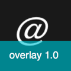

# IconOverlay

Small command line tool (more of a quick and dirty hack) to overlay a short text on the app icon image without using third party image manipulation dependencies.

Use it from Xcode run-script phase before the app is signed.

## Build

```
xcrun -sdk macosx swiftc IconOverlay.swift -o IconOverlay
```
Or just type `make`.

Also, copy it to some directory in your PATH.

## Usage

```
IconOverlay <input-image> <output-image> "<message>" [<RRGGBBAA>]
```

Where:

* `<input-image>` is the path to the icon
*  `<output-image>` is the path where to save the resulting image
*  `<message>` is the short text we want to put over the image, use quotes if it has spaces
*  `<RRGGBBAA>` optional background color (foreground color is white, default background blueish)

## Example

```
cd example
IconOverlay input.png output.png "overlay 1.0" 0ABBCCA0
```

 → 

## Tips

Overlay the branch name:

```
branch=`git rev-parse --abbrev-ref HEAD`
IconOverlay input.png output.png "${branch}" 0ABBCCA0
```

Overlay the app version:

```
version=`PlistBuddy -c "Print CFBundleShortVersionString" /path/to/Info.plist`
IconOverlay input.png output.png "${version}" 0ABBCCA0
```
